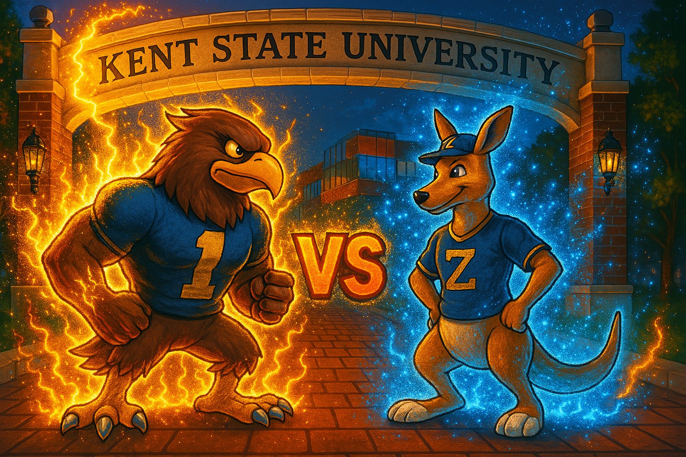

# Flash vs Zippy 🦅🐿️🔥


---

### 🎮 About This Project

- A 2D fighting game developed using [Pygame](https://github.com/pygame/pygame).
- Demonstrates socket programming at the application layer.
- Created as part of `CS 35201: Computer Communication Networks` at Kent State University.

---

### 📝 Credits

- **Base Project:** [brawler_tut](https://github.com/russs123/brawler_tut)
- **Character Sprites Generator:** [voidless.dev](https://voidless.dev/)
- **Sound Effects (SFX):** [creatorassets.com](https://creatorassets.com/a/8bit-explosion-sound-effects)
- **Background Music (BGM):** [Jeremy Blake](https://youtu.be/l7SwiFWOQqM?si=aOPvpQX5mA9BMm-6)

---

### 🚀 Project Setup

1. Install Python 3.7.9 (either locally or in a virtual environment).

2. Install required packages:
   ```bash
   pip install pygame==2.6.1
   ```
   or
   ```bash
   pip install -r requirements.txt
   ```

3. Run the game:
   ```bash
   python Flash-vs-Zippy/main_socket.py
   ```

---

### 🎮 Gameplay

<div style="display: flex; justify-content: space-around;">

<div style="flex: 1; text-align: center;">

#### 🐿️ Zippy


**A**: Move left  
**D**: Move right  
**W**: Jump  
**R**: Attack 1 (Punch)  
**T**: Attack 2 (Ranged attack)

</div>

<div style="flex: 1; text-align: center;">

#### 🦅 Flash


 **Left Arrow**: Move left  
**Right Arrow**: Move right  
 **Up Arrow**: Jump  
**K**: Attack 1 (Punch)  
 **L**: Attack 2 (Ranged attack)

</div>

</div>